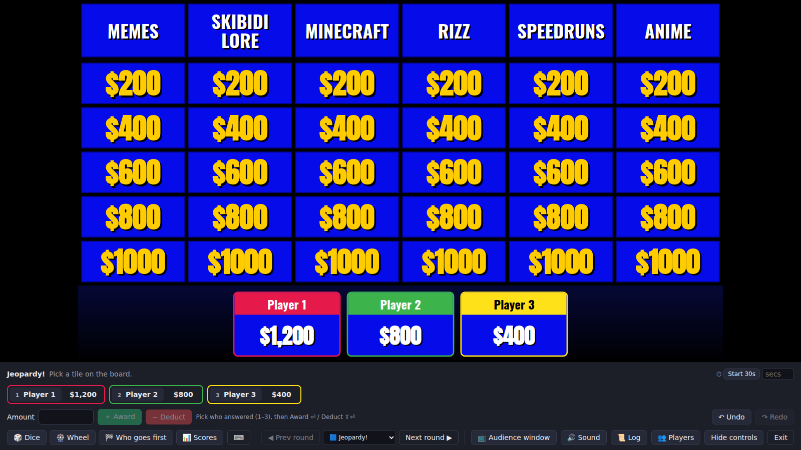
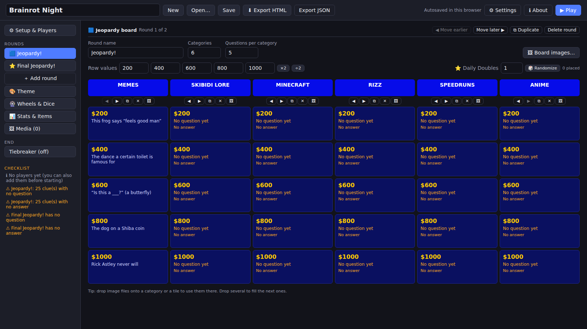
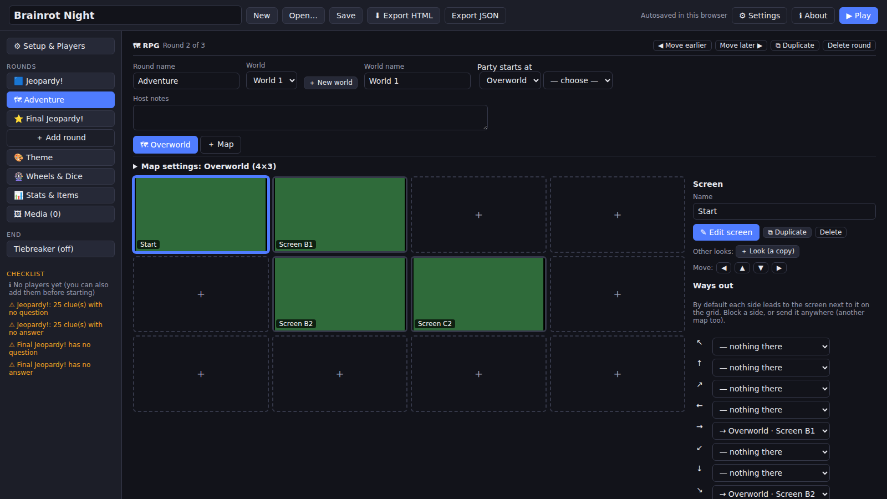
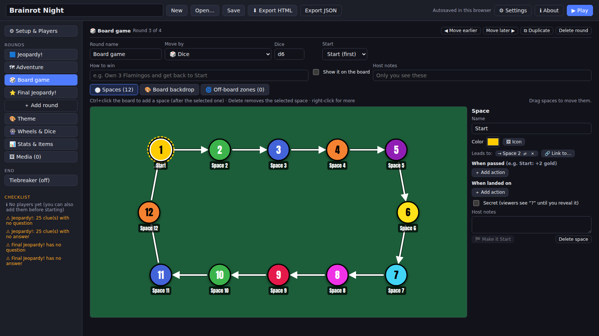
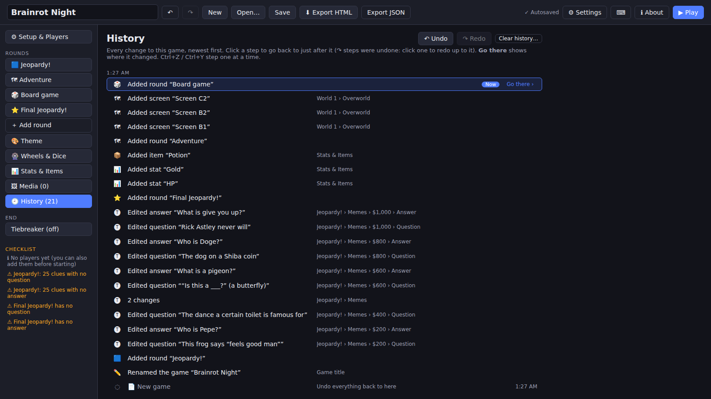
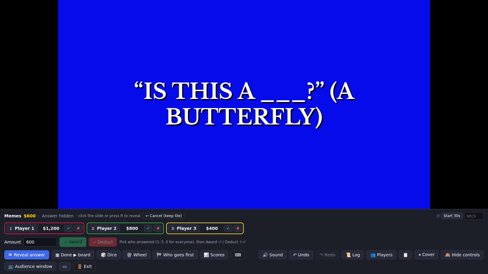
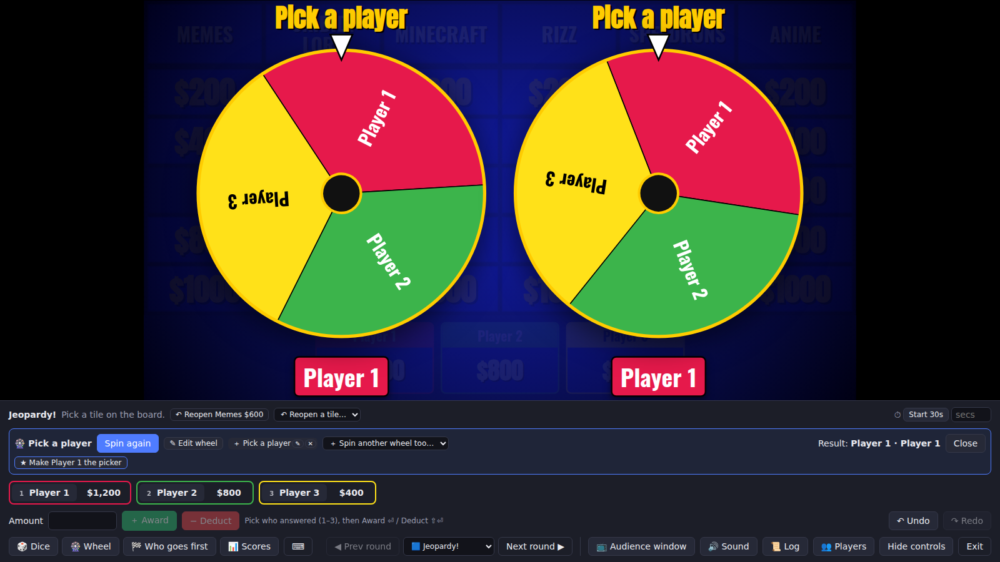
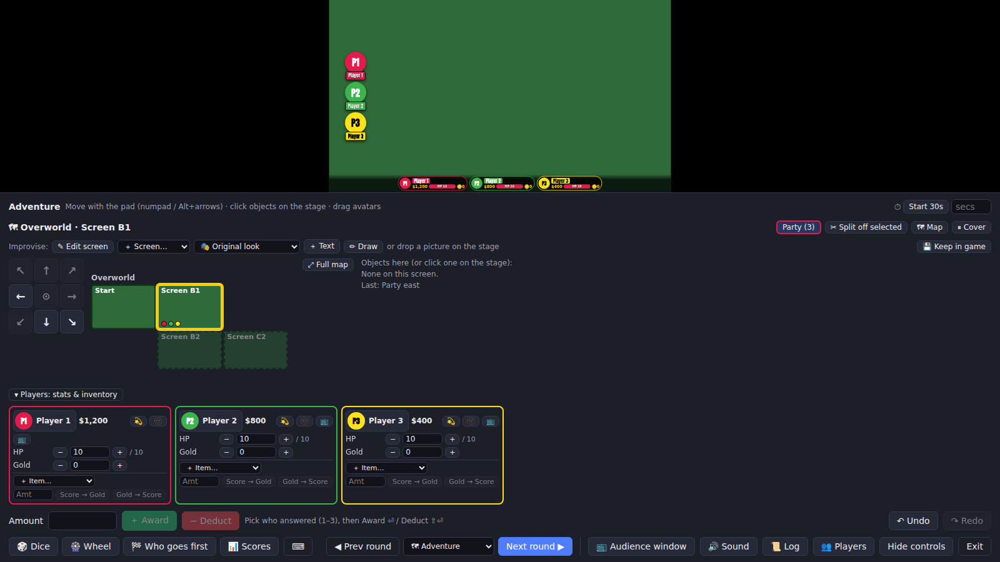
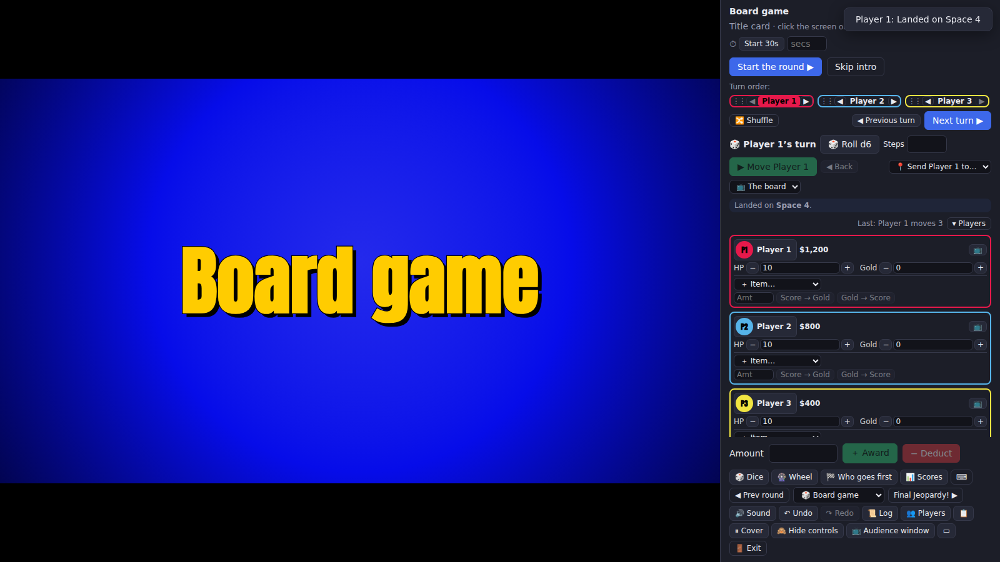

# Brainrot Games Maker

Build and host game shows for livestreams: Jeopardy boards, Final Jeopardy, RPG adventures and board games. The host
runs everything and players answer by voice on the stream.

The whole app is **one HTML file**. Open it in a browser with no install, server or internet. There's also a Windows
desktop app.



## Download

Get it from the **[Latest release](../../releases/latest)**, which is rebuilt on every push to `main`:

- **`brainrot-game-maker.html`**: double-click it to open it in Chrome, Edge or Firefox.
- **`brainrot-game-maker-portable.exe`**: the Windows desktop app. No install needed.

Old Jeopardy Builder games (`.jbr` packs and exported HTML files) still open.

## Quick start

1. **＋ Add round** and pick a mode.
2. Fill it in. For example, click a tile to type the clue, then **Tab** to the answer and **Ctrl+Enter** for the next
   clue.
3. Press **▶ Play**, then add the players (and set the game rules) on the pre-game screen.

New here? **Try a sample game** on the first screen, or start from a template in **＋ Add round**. **Import clues…**
on a board takes a sheet pasted from Google Sheets or Excel, and **Find** (`Ctrl+F`) searches the whole game.



## Round modes

A game is a list of rounds, and each round has a mode. You can reorder, duplicate or delete any round. **Copy round**
(a round tab's right-click menu) and **📋 Paste round**, or **📂 Import round from a .brainrot…**, bring a round from
another game with the worlds, wheels, dice, stats, items, shops and files it uses. Where this game already has one of
those from another copy of the same game but it differs, the other version comes in as a copy and this game's stays.

| Mode | What it is |
|---|---|
| 🟦 **Jeopardy board** | 1–10 categories × 1–10 clues. Supports custom values, Daily Doubles, and images on categories and tiles. |
| ⭐ **Final Jeopardy** | Private wagers, think music, then a one-by-one reveal and a winner screen. |
| 🗺 **RPG** | Players explore a map of screens. It has stats, items, shops, characters and doorways. |
| 🎲 **Board game** | A path of spaces with forks and zones. Players move by dice, a wheel, or one space per turn. |

Every clue or screen is a **slide**: text, images, GIFs, video, audio or YouTube, arranged freely.

<table>
<tr>
<td></td>
<td></td>
</tr>
<tr>
<td align="center">RPG world editor</td>
<td align="center">Board game editor</td>
</tr>
</table>

**Keyboard and drag:** round tabs, clue tiles, categories, rows, list items and map screens can be dragged and have
right-click menus; `Delete`, `F2`, `Ctrl+D` and `Ctrl+C` / `Ctrl+V` work on what's selected. Files drop onto the slot
they belong in. Press `?` (or ⌨ next to ℹ About) for every editor shortcut.

**RPG map editor:** drag a screen to move it or swap it with another (dropping past the edge grows the map, dropping
on a map tab moves it there), `Delete` deletes the selected screens, arrows / `Enter` / `Alt`+arrows / `Ctrl+D` /
`Ctrl+C` `Ctrl+V` / `F2` work on the grid, `Shift`-click or a box selects several, and pictures dropped on the map
become screens. Click ⛔ between two screens to block the way.

Other editor tabs:

- 🔊 **Sounds**: the sounds played on stream (right, wrong, dice, wheel, buzz…): preview, replace or switch each off.
- 🎨 **Theme**: presets, colors, fonts and background images.
- 🎡 **Wheels & Dice**: weighted wheels and custom dice. Each outcome can carry a score effect or action buttons.
- 📊 **Stats & Items**: HP bars, currencies, items, wearable gear and shops.

**Copy and paste** slide items or whole slides between clues, rounds and even games; their pictures and sounds come
along.

**Right-click** almost anything for a quick menu. This works on rounds, tiles, map screens, spaces, avatars and items.

**Undo** (`Ctrl+Z`, `Ctrl+Y` to redo) covers every change in the editor and takes you to where it happened. Deleting
doesn't ask first: a "Deleted … · Undo" note brings it back. The **🕘 History** tab lists every change and jumps back to
any point; it survives a reload (⚙ Settings sets how many changes it keeps, 300 by default).



## Hosting

Press **▶ Play** to get to the pre-game screen. Add the players there (rename, recolor, pick a picture, drag ⋮⋮ or
`Alt`+arrows to reorder; they're kept with the game for next time), open **⚙ Game rules** for scoring, the most
players, timers and the round intro, and turn on phone buzzers on the **📱 Phone buzzers** card (all saved with the game
too). Then pick one of two modes. Viewers see a "Starting soon…" card until you press **Start game**.

- **Single window**: viewers see this window. Press `H` to hide the host controls.
- **📺 Separate audience window**: a clean window to capture in OBS or Discord. The host window keeps the answers,
  notes and controls.

Click a tile to open its clue, then reveal the answer with `R` or a click. Select players and **Award** or **Deduct**.
Every change can be undone with `Ctrl+Z`, including RPG and board game moves, items and live edits.
Nothing pops up over the stage: questions for the host (a locked door, naming a new screen…) appear in the host panel.



**Tools, any time:**

- 🎲 Dice
- 🎡 Wheels, including a built-in **Pick a player** wheel. Several wheels can spin at once.
- 🏁 Who goes first
- 📊 Scores (with 📋 Copy standings for chat)

**Phone buzzers** (Buzzer mode, on the pre-game screen's 📱 Phone buzzers card, saved with the game): start the room
and share the code, link or QR code (it's on the viewers' Starting soon card too). Players open the link on their
phone, tap their name and get a big BUZZ button, Jackbox-style; new players can ask to join from their phone if you
allow it. The buzzers open when the clue does, or when you press `U` after reading it. The fastest reaction wins, timed
on each player's own phone, so a slow connection doesn't cost anyone the buzz. Every buzz is listed in the host panel,
fastest first: a wrong answer locks that player out and opens the buzzers for the rest, **→ Next in line** gives the
answer to the next one who buzzed, and **↺ Reset buzzers** (`0`) lets everyone buzz again. Buzzes within 0.01 s are a
tie: **🎲 Roll for it** sets who answers first, or pick one yourself (`1`–`9` or a click always picks by hand). Viewers
see "🔔 Ann is answering" whenever one player is picked during a clue. The rooms run on a small buzzer server
(`buzzer/`, a Cloudflare Worker); the release builds come with one, and ⚙ Settings › Buzzer server can point at your
own. Copies built without one say "Phone buzzers aren't set up in this copy".

**Sounds** are built in and on by default (right, wrong, dice, wheel, buzz, reveal…): preview, replace or switch each
off in the editor's 🔊 Sounds tab.

**For OBS:** Theme › Stage background can be chroma green or magenta for keying, and **▭** (or `Shift+A`) opens a
scores-only window for a lower-third capture. The "Starting soon" and cover cards can be edited, with a countdown
(the host sees its time left). **Reduce motion on stream** is in the pre-game screen's On stream section too.

**Single-window mode shows viewers everything on screen**, including wagers as you type them, answers, host notes and
hidden objects. Use the separate audience window when that matters.



**RPG rounds** have these controls:

- A movement pad, and a minimap that expands to the full map so you can jump the party anywhere.
- Split and regroup parties.
- Player cards with stats and inventory.
- Shops.
- Live improvising: edit the screen, add text, or draw objects on a drawpad.

**Board game rounds** have these controls:

- Roll and move, picking the way at each fork.
- Send players to any space.
- Each space's actions.

<table>
<tr>
<td></td>
<td></td>
</tr>
</table>

**Ties** for first aren't called a win on stream until they're settled, in one of three ways:

- A roll-off, whose winner wins the game.
- A tiebreaker clue.
- Co-winners.

**Exit** keeps the game in progress, and **Resume game** picks it up later, even after a crash.

### Keyboard shortcuts

| Key | Action |
|---|---|
| `1`–`9` | Select player N |
| `Enter` / `Shift+Enter` | Award / deduct |
| `R` | Reveal / hide the answer |
| `Esc` / `Shift+Esc` | Back to the board / cancel the clue (the tile stays playable) |
| `N` | Next step (intro, Final, next turn) |
| `C` / `X` | Final reveal: right / wrong |
| `T` | Start/pause the timer |
| `D` / `W` / `O` / `S` | Roll the last dice again (a board game's own dice) / wheel / roll-off / scoreboard |
| `K` or `B` | "Be right back" cover (every round) |
| `0` | Select everyone or no one (in buzzer mode: reset the buzzers) |
| `U` | Buzzer mode: open the buzzers (when they open on your key) |
| `Shift+A` | Scores-only window |
| `Space` / `←` `→` / `M` | Play/pause, seek, mute media |
| `Ctrl+Z` / `Ctrl+Shift+Z` | Undo / redo |
| `J` / `V` (RPG) | Full map / map on screen |
| `I` (RPG, board game) | Player sheet |
| Numpad or `Alt`+arrows (RPG) | Move the party |

## Saving

- **Save** (`Ctrl+S`) writes a `.brainrot` pack: the game plus all its media.
  - In the desktop app, saves go in a **BrainrotSaves** folder next to the `.exe`.
  - In a browser, they're downloads.
- **Open…** lists your **Recent games** (a game replaced by New or Open… can be reopened, with its undo history) and,
  in the desktop app, BrainrotSaves. It also opens exported HTML files. Dropping a `.brainrot` on the editor opens it,
  and the desktop app opens a game file you open it with.
- New and Open… ask **Save first / Discard / Cancel** when the game has unsaved changes. Only one browser tab edits at a
  time: another tab waits, paused, and offers **Edit here** once the editing tab closes.
- **⬇ Export HTML** makes a single file to host the game from, with everything inside. It shows the answers, so keep
  it to yourself.
- Add pictures, videos, sounds and fonts on the **🖼 Media** page: drop them there, or use **⬆ Add files…**.
- **⚙ Settings** (in the header's ⋯ menu, with Export JSON, ⌨ Keyboard shortcuts and ℹ About) has these options:
  - **Reduce motion on stream** (the editor and host controls also follow your computer's reduce-motion setting).
  - **Undo**: how many changes Ctrl+Z and the 🕘 History tab remember (300 by default).
  - **Autosave** every few minutes (desktop app). The default is every 5 minutes, keeping the last 3.
  - **Save replaces the game's last save** and keeps the two before it as `.bak` / `.bak2` (desktop app, on by
    default); off makes `Game (2)`, `Game (3)`… instead. Autosaves are kept per game.

## Streaming the sound (Discord, OBS)

In dual-window mode, the sound plays from the **audience window**. **🔊 Sound** in the host panel has a **Test sound**
button, a speaker picker (e.g. for a virtual cable into OBS), and step-by-step help.

**Discord:**

1. **Share Your Screen › Applications**.
2. Pick the audience window, with **Sound** on.
3. If viewers hear nothing, turn on Discord's *experimental method to capture audio* (**Voice & Video › Screen Share**)
   and restart Discord.

**Desktop app:**

- Don't run it as administrator or with compatibility settings. Discord and OBS can't hear it then.
- The **Discord audio fix** is on by default. Switch it off in the 🔊 Sound help.
- If the window stays blank, turn the fix off in either of these ways, then reopen the app:
  - Start the app with `--no-audio-fix`.
  - Create an empty file named `discord-audio-fix-off` in `%APPDATA%\com.brainrotgames.maker\`.

  ```bat
  mkdir "%APPDATA%\com.brainrotgames.maker" 2>nul & type nul > "%APPDATA%\com.brainrotgames.maker\discord-audio-fix-off"
  ```

The desktop app keeps its data in `%LOCALAPPDATA%\com.brainrotgames.maker`: the game in progress and media. Settings go
in `%APPDATA%\com.brainrotgames.maker`. **ℹ About** opens both folders. To uninstall, delete the `.exe` and those
folders.

## Development

```sh
npm install
npm run dev            # dev server
npm run build          # → dist/index.html (one self-contained file)
npm run check          # type-check
npm test               # unit tests
npm run test:e2e       # end-to-end tests on the built file
npm run screenshots    # regenerate docs/screenshots (build first)
npm run desktop:build  # Windows app (needs Rust + Tauri prerequisites)
```

The stack is Svelte 5, TypeScript and Vite, bundled into a single file. The desktop app is [Tauri](https://tauri.app)
(`src-tauri/`). Specs are in [`docs/SPEC.md`](docs/SPEC.md) and
[`docs/GAMES-MAKER-SPEC.md`](docs/GAMES-MAKER-SPEC.md).

| Path | What's there |
|---|---|
| `src/lib/` | Model, game flow and scoring, tools, media, saving, RPG (`rpg.ts`) and board game (`boardgame.ts`) logic |
| `src/editor/` | The editor |
| `src/play/` | Hosting: the stage, host panel, RPG and board game play |
| `src/audience/` | The audience window |
| `src-tauri/` | The desktop app |
| `tests/e2e/`, `scripts/` | Browser tests and the screenshot script |
